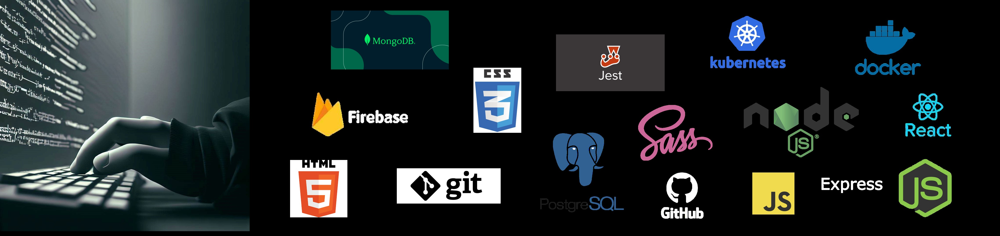

# Hello, I'm Pablo!

## ...About me:
I must start by saying that I'm a programmer almost since birth, because when I had a minimum of reasoning and logic thinking capacity, I came into this world by chance and I could never scape...
it's my true passion, and if I could choose a dream in this life, it is to be able to dedicate myself and live from programming. Although everything I know I learned self-taught, I decided to do a Full Stack coding bootcamp, to specialize in web development.

Here you'll find some of the projects I developed, there is a bit of everything, but it's true that most of it is done with Node, Express and React.

## Links:
These are some links for you to know me a little bit more:
* My [portfolio](https://www.pablopace.info/), here are some of the projects I've worked on.
* [LinkedIn](https://www.linkedin.com/in/pablopace-dev/) profile.
* [CodeWars](https://www.codewars.com/users/pablo2637/) profile.
  
---
# Hola, soy Pablo!

## ...Sobre mí:
Tengo que empezar diciendo que soy un programador casi desde nacimiento, porque desde que tuve un mínimo de capacidad de razonamiento y pensamiento lógico, caí por casualidad en este mundo y no he podido alejarme jamás... 
es simplemente mi pasión, y si tengo que elegir un sueño en esta vida, es poder dedicarme y vivir de la programación. Auqnue casi todo lo que sé lo aprendí de manera autodidacta, decidí hacer un bootcamp en Full Stack, para especializarme en desarrollo web.

Aquí encontrarán algunos de los proyectos que he realizado, hay un poco de todo, pero es cierto que la mayoría esta hecho con Node, Express y React. 

---
## Links:

Algunos enlaces para que me conozcas más:
* Mi [portfolio](https://www.pablopace.info/), aquí hay algunos de los proyectos en los que he trabajado.
* Perfil de [LinkedIn](https://www.linkedin.com/in/pablopace-dev/).
* Perfil de [CodeWars](https://www.codewars.com/users/pablo2637/).
